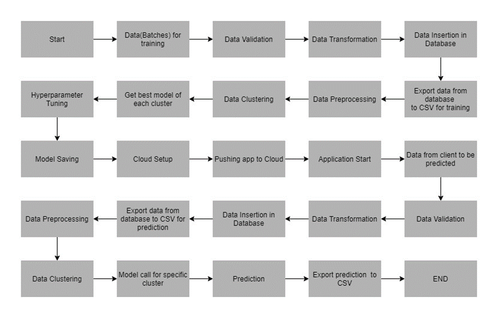

# **cement_strength_reg**
## Deployed Link: https://fraud_detection.herokuapp.com/
## Problem Statement
To build a classification methodology to deternmine whether a customer is placing a fraudulent insurance claim.

## Architecture

## Data Validation
In this step, we perform different sets of validation on the given set of training files.

Name Validation: We validate the name of the files based on the given name in the schema file. We have 
created a regex patterg as per the name given in the schema fileto use for validation. After validating 
the pattern in the name, we check for the length of the date in the file name as well as the length of time 
in the file name. If all the values are as per requirements, we move such files to "Good_Data_Folder" else
we move such files to "Bad_Data_Folder."

Number of Columns: We validate the number of columns present in the files, and if it doesn't match with the
value given in the schema file, then the file id moves to "Bad_Data_Folder."

Name of Columns: The name of the columns is validated and should be the same as given in the schema file. 
If not, then the file is moved to "Bad_Data_Folder".

The datatype of columns: The datatype of columns is given in the schema file. This is validated when we insert
the files into Database. If the datatype is wrong, then the file is moved to "Bad_Data_Folder."

Null values in columns: If any of the columns in a file have all the values as NULL or missing, we discard such
a file and move it to "Bad_Data_Folder".

##  Data Insertion in Database
 Database Creation and Connection: Create a database with the given name passed. If the database is already created,
 open the connection to the database.
 
 Table creation in the database: Table with name - "Good_Data", is created in the database for inserting the files 
 in the "Good_Data_Folder" based on given column names and datatype in the schema file. If the table is already
 present, then the new table is not created and new files are inserted in the already present table as we want 
 training to be done on new as well as old training files.
 
 Insertion of file in the table: All the files in the "Good_Data_Folder" are inserted in the above-created table. If
 any file has invalid data type in any of the columns, the file is not loaded in the table and is moved to 
 "Bad_Data_Folder".
 
## Model Training
 Data Export from Db: The data in a stored database is exported as a CSV file to be used for model training.
 
 Data Preprocessing: 
    Check for null values in the columns. If present, impute the null values using the KNN imputer.
    
    Check if any column has zero standard deviation, remove such columns as they don't give any information during 
    model training.
    
 Clustering: KMeans algorithm is used to create clusters in the preprocessed data. The optimum number of clusters 
 is selected

## initialize git repo 

git init
git add .
git commit -m "first commit"
git branch -M main
git remote add origin <github_url>
git push -u origin main